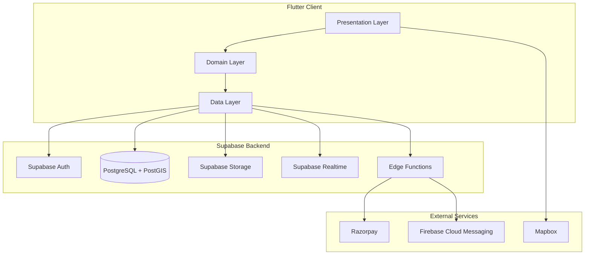
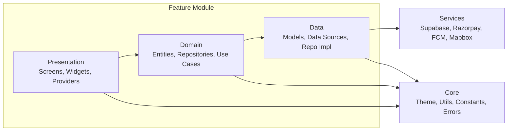

# Design Document: Hall Booking Platform

## Overview

The Hall Booking Platform is a cross-platform application (Android, iOS, Web) built with Flutter and backed by Supabase. It connects users seeking venue spaces with hall owners, facilitated by an admin layer. The architecture follows clean architecture principles with clear separation between data, domain, and presentation layers. Key technical challenges include real-time geo-spatial queries via PostGIS, race-condition-free booking via database-level locking, secure payment processing via Razorpay, and push notifications via FCM.

The system uses Supabase for authentication (JWT), PostgreSQL with PostGIS for spatial data, Supabase Storage for images, Supabase Realtime for live updates, and Supabase Edge Functions for server-side logic (payment verification, notifications).

## Architecture

### High-Level Architecture



### Clean Architecture Layers



### Directory Structure

```
lib/
├── core/
│   ├── constants/
│   ├── errors/
│   ├── theme/
│   ├── utils/
│   └── widgets/          # Shared widgets
├── features/
│   ├── auth/
│   │   ├── data/         # Models, data sources, repo impl
│   │   ├── domain/       # Entities, repository interfaces, use cases
│   │   └── presentation/ # Screens, widgets, providers
│   ├── discovery/
│   ├── booking/
│   ├── payment/
│   ├── profile/
│   ├── reviews/
│   ├── notifications/
│   ├── owner/
│   │   ├── hall_management/
│   │   ├── availability/
│   │   ├── bookings/
│   │   └── earnings/
│   └── admin/
│       ├── approval/
│       ├── users/
│       ├── analytics/
│       └── commission/
├── services/
│   ├── supabase_service.dart
│   ├── razorpay_service.dart
│   ├── mapbox_service.dart
│   ├── fcm_service.dart
│   └── location_service.dart
├── routing/
│   └── app_router.dart
└── main.dart
```

## Components and Interfaces

### 1. Authentication Component

```dart
// Domain - Entity
@freezed
class AppUser with _$AppUser {
  const factory AppUser({
    required String id,
    required String role, // 'user', 'owner', 'admin'
    required String name,
    required String phone,
    String? email,
    String? profileImageUrl,
    required DateTime createdAt,
  }) = _AppUser;
}

// Domain - Repository Interface
abstract class AuthRepository {
  Future<Either<Failure, AppUser>> signInWithOtp(String phone);
  Future<Either<Failure, AppUser>> verifyOtp(String phone, String otp);
  Future<Either<Failure, AppUser>> signInWithGoogle();
  Future<Either<Failure, void>> signOut();
  Stream<AppUser?> authStateChanges();
}

// Domain - Use Cases
class SignInWithOtpUseCase {
  Future<Either<Failure, AppUser>> call(String phone);
}

class VerifyOtpUseCase {
  Future<Either<Failure, AppUser>> call(String phone, String otp);
}
```

### 2. Discovery Component

```dart
// Domain - Entity
@freezed
class Hall with _$Hall {
  const factory Hall({
    required String id,
    required String ownerId,
    required String name,
    required String description,
    required double lat,
    required double lng,
    required String address,
    required List<String> amenities,
    required int slotDurationMinutes,
    required double basePrice,
    required String approvalStatus,
    required DateTime createdAt,
    double? distance, // calculated field from PostGIS
    double? averageRating,
    List<String>? imageUrls,
  }) = _Hall;
}

// Domain - Repository Interface
abstract class DiscoveryRepository {
  Future<Either<Failure, List<Hall>>> getNearbyHalls({
    required double lat,
    required double lng,
    required double radiusKm,
    required int page,
    required int pageSize,
  });
  Future<Either<Failure, List<Hall>>> searchHalls({
    required String query,
    double? lat,
    double? lng,
    required int page,
    required int pageSize,
  });
  Future<Either<Failure, Hall>> getHallDetails(String hallId);
}
```

### 3. Booking Component

```dart
// Domain - Entity
@freezed
class Slot with _$Slot {
  const factory Slot({
    required String id,
    required String hallId,
    required DateTime date,
    required String startTime, // HH:mm format
    required String endTime,
    required String status, // 'available', 'booked', 'blocked'
  }) = _Slot;
}

@freezed
class Booking with _$Booking {
  const factory Booking({
    required String id,
    required String userId,
    required String hallId,
    required String slotId,
    required double totalPrice,
    required String paymentStatus,
    required String bookingStatus,
    required DateTime createdAt,
    Hall? hall,
    Slot? slot,
  }) = _Booking;
}

// Domain - Repository Interface
abstract class BookingRepository {
  Future<Either<Failure, List<Slot>>> getAvailableSlots({
    required String hallId,
    required DateTime date,
  });
  Future<Either<Failure, Booking>> createBooking({
    required String hallId,
    required String slotId,
  });
  Future<Either<Failure, List<Booking>>> getUserBookings({
    required int page,
    required int pageSize,
  });
  Future<Either<Failure, Booking>> cancelBooking(String bookingId);
}
```

### 4. Payment Component

```dart
// Domain - Entity
@freezed
class Payment with _$Payment {
  const factory Payment({
    required String id,
    required String bookingId,
    String? razorpayPaymentId,
    required String status,
    required double amount,
  }) = _Payment;
}

// Domain - Repository Interface
abstract class PaymentRepository {
  Future<Either<Failure, String>> createRazorpayOrder({
    required String bookingId,
    required double amount,
  });
  Future<Either<Failure, Payment>> verifyPayment({
    required String bookingId,
    required String razorpayPaymentId,
    required String razorpayOrderId,
    required String razorpaySignature,
  });
}
```

### 5. Owner Component

```dart
// Domain - Repository Interface
abstract class OwnerHallRepository {
  Future<Either<Failure, Hall>> createHall(HallCreateRequest request);
  Future<Either<Failure, Hall>> updateHall(String hallId, HallUpdateRequest request);
  Future<Either<Failure, void>> uploadHallImages(String hallId, List<File> images);
  Future<Either<Failure, void>> blockSlots({
    required String hallId,
    required DateTime startDate,
    required DateTime endDate,
  });
  Future<Either<Failure, void>> unblockSlots({
    required String hallId,
    required DateTime startDate,
    required DateTime endDate,
  });
  Future<Either<Failure, List<Booking>>> getHallBookings({
    required String hallId,
    required int page,
  });
  Future<Either<Failure, EarningsReport>> getEarnings({
    required String hallId,
    required String period, // 'daily', 'weekly', 'monthly'
  });
}

@freezed
class EarningsReport with _$EarningsReport {
  const factory EarningsReport({
    required double grossRevenue,
    required double commissionAmount,
    required double netEarnings,
    required double commissionPercentage,
    required List<EarningEntry> entries,
  }) = _EarningsReport;
}
```

### 6. Admin Component

```dart
// Domain - Repository Interface
abstract class AdminRepository {
  Future<Either<Failure, List<Hall>>> getPendingHalls({required int page});
  Future<Either<Failure, void>> approveHall(String hallId);
  Future<Either<Failure, void>> rejectHall(String hallId, String reason);
  Future<Either<Failure, List<AppUser>>> getUsers({required int page});
  Future<Either<Failure, void>> updateUserRole(String userId, String role);
  Future<Either<Failure, void>> deactivateUser(String userId);
  Future<Either<Failure, AnalyticsDashboard>> getAnalytics(String period);
  Future<Either<Failure, void>> setCommissionPercentage(double percentage);
}

@freezed
class AnalyticsDashboard with _$AnalyticsDashboard {
  const factory AnalyticsDashboard({
    required int totalBookings,
    required double totalRevenue,
    required int activeUsers,
    required int activeHalls,
    required String period,
  }) = _AnalyticsDashboard;
}
```

### 7. Review Component

```dart
@freezed
class Review with _$Review {
  const factory Review({
    required String id,
    required String userId,
    required String hallId,
    required int rating,
    String? comment,
    required DateTime createdAt,
    String? userName,
  }) = _Review;
}

abstract class ReviewRepository {
  Future<Either<Failure, void>> submitReview({
    required String hallId,
    required int rating,
    String? comment,
  });
  Future<Either<Failure, List<Review>>> getHallReviews({
    required String hallId,
    required int page,
  });
}
```

### 8. Notification Component

```dart
abstract class NotificationService {
  Future<void> registerToken();
  Future<void> handleForegroundMessage(RemoteMessage message);
  void setupBackgroundHandler();
}

// Supabase Edge Function (server-side)
// send_notification(userId, title, body, data)
// schedule_reminder(bookingId, slotStartTime)
```

### 9. Routing and Guards

```dart
// GoRouter with role-based guards
class AppRouter {
  static GoRouter router(Ref ref) {
    return GoRouter(
      routes: [...],
      redirect: (context, state) {
        // Check auth state
        // Check role permissions
        // Redirect unauthorized access
      },
    );
  }
}
```

## Data Models

### Database Schema (PostgreSQL + PostGIS)

```sql
-- Enable PostGIS
CREATE EXTENSION IF NOT EXISTS postgis;

-- Users table
CREATE TABLE users (
    id UUID PRIMARY KEY DEFAULT gen_random_uuid(),
    role TEXT NOT NULL DEFAULT 'user' CHECK (role IN ('user', 'owner', 'admin')),
    name TEXT NOT NULL,
    phone TEXT UNIQUE NOT NULL,
    email TEXT,
    profile_image_url TEXT,
    is_active BOOLEAN DEFAULT true,
    fcm_token TEXT,
    created_at TIMESTAMPTZ DEFAULT now()
);

-- Halls table with PostGIS geography
CREATE TABLE halls (
    id UUID PRIMARY KEY DEFAULT gen_random_uuid(),
    owner_id UUID NOT NULL REFERENCES users(id),
    name TEXT NOT NULL,
    description TEXT,
    location GEOGRAPHY(POINT, 4326) NOT NULL,
    address TEXT NOT NULL,
    amenities JSONB DEFAULT '[]',
    slot_duration_minutes INTEGER NOT NULL CHECK (slot_duration_minutes BETWEEN 30 AND 480),
    base_price DECIMAL(10,2) NOT NULL CHECK (base_price > 0),
    approval_status TEXT NOT NULL DEFAULT 'pending' CHECK (approval_status IN ('pending', 'approved', 'rejected')),
    created_at TIMESTAMPTZ DEFAULT now()
);

-- Spatial index for geo queries
CREATE INDEX idx_halls_location ON halls USING GIST(location);
CREATE INDEX idx_halls_approval ON halls(approval_status);

-- Hall images
CREATE TABLE hall_images (
    id UUID PRIMARY KEY DEFAULT gen_random_uuid(),
    hall_id UUID NOT NULL REFERENCES halls(id) ON DELETE CASCADE,
    image_url TEXT NOT NULL,
    sort_order INTEGER DEFAULT 0,
    created_at TIMESTAMPTZ DEFAULT now()
);

-- Slots with unique constraint for double-booking prevention
CREATE TABLE slots (
    id UUID PRIMARY KEY DEFAULT gen_random_uuid(),
    hall_id UUID NOT NULL REFERENCES halls(id),
    date DATE NOT NULL,
    start_time TIME NOT NULL,
    end_time TIME NOT NULL,
    status TEXT NOT NULL DEFAULT 'available' CHECK (status IN ('available', 'booked', 'blocked')),
    UNIQUE(hall_id, date, start_time)
);

CREATE INDEX idx_slots_hall_date ON slots(hall_id, date);

-- Bookings
CREATE TABLE bookings (
    id UUID PRIMARY KEY DEFAULT gen_random_uuid(),
    user_id UUID NOT NULL REFERENCES users(id),
    hall_id UUID NOT NULL REFERENCES halls(id),
    slot_id UUID NOT NULL REFERENCES slots(id),
    total_price DECIMAL(10,2) NOT NULL,
    payment_status TEXT NOT NULL DEFAULT 'pending' CHECK (payment_status IN ('pending', 'completed', 'failed', 'refunded')),
    booking_status TEXT NOT NULL DEFAULT 'pending' CHECK (booking_status IN ('pending', 'confirmed', 'cancelled', 'completed')),
    created_at TIMESTAMPTZ DEFAULT now()
);

CREATE INDEX idx_bookings_user ON bookings(user_id);
CREATE INDEX idx_bookings_hall ON bookings(hall_id);

-- Payments
CREATE TABLE payments (
    id UUID PRIMARY KEY DEFAULT gen_random_uuid(),
    booking_id UUID NOT NULL REFERENCES bookings(id),
    razorpay_payment_id TEXT,
    razorpay_order_id TEXT,
    status TEXT NOT NULL DEFAULT 'pending' CHECK (status IN ('pending', 'completed', 'failed', 'refunded')),
    amount DECIMAL(10,2) NOT NULL,
    created_at TIMESTAMPTZ DEFAULT now()
);

-- Reviews with one-review-per-user-per-hall constraint
CREATE TABLE reviews (
    id UUID PRIMARY KEY DEFAULT gen_random_uuid(),
    user_id UUID NOT NULL REFERENCES users(id),
    hall_id UUID NOT NULL REFERENCES halls(id),
    rating INTEGER NOT NULL CHECK (rating BETWEEN 1 AND 5),
    comment TEXT,
    created_at TIMESTAMPTZ DEFAULT now(),
    UNIQUE(user_id, hall_id)
);

-- Platform configuration
CREATE TABLE platform_config (
    key TEXT PRIMARY KEY,
    value JSONB NOT NULL,
    updated_at TIMESTAMPTZ DEFAULT now()
);

-- Insert default commission
INSERT INTO platform_config (key, value) VALUES ('commission_percentage', '10');
```

### Row-Level Security Policies

```sql
-- Users: read own, admin reads all
ALTER TABLE users ENABLE ROW LEVEL SECURITY;
CREATE POLICY users_select ON users FOR SELECT USING (
    auth.uid() = id OR
    EXISTS (SELECT 1 FROM users WHERE id = auth.uid() AND role = 'admin')
);
CREATE POLICY users_update ON users FOR UPDATE USING (
    auth.uid() = id OR
    EXISTS (SELECT 1 FROM users WHERE id = auth.uid() AND role = 'admin')
);

-- Halls: public read approved, owner modifies own, admin modifies all
ALTER TABLE halls ENABLE ROW LEVEL SECURITY;
CREATE POLICY halls_select ON halls FOR SELECT USING (
    approval_status = 'approved' OR
    owner_id = auth.uid() OR
    EXISTS (SELECT 1 FROM users WHERE id = auth.uid() AND role = 'admin')
);
CREATE POLICY halls_insert ON halls FOR INSERT WITH CHECK (
    owner_id = auth.uid() AND
    EXISTS (SELECT 1 FROM users WHERE id = auth.uid() AND role IN ('owner', 'admin'))
);
CREATE POLICY halls_update ON halls FOR UPDATE USING (
    owner_id = auth.uid() OR
    EXISTS (SELECT 1 FROM users WHERE id = auth.uid() AND role = 'admin')
);

-- Bookings: user reads own, owner reads hall bookings, admin reads all
ALTER TABLE bookings ENABLE ROW LEVEL SECURITY;
CREATE POLICY bookings_select ON bookings FOR SELECT USING (
    user_id = auth.uid() OR
    EXISTS (SELECT 1 FROM halls WHERE halls.id = bookings.hall_id AND halls.owner_id = auth.uid()) OR
    EXISTS (SELECT 1 FROM users WHERE id = auth.uid() AND role = 'admin')
);
CREATE POLICY bookings_insert ON bookings FOR INSERT WITH CHECK (
    user_id = auth.uid()
);

-- Slots: public read, owner manages own hall slots, admin manages all
ALTER TABLE slots ENABLE ROW LEVEL SECURITY;
CREATE POLICY slots_select ON slots FOR SELECT USING (true);
CREATE POLICY slots_insert ON slots FOR INSERT WITH CHECK (
    EXISTS (SELECT 1 FROM halls WHERE halls.id = slots.hall_id AND halls.owner_id = auth.uid()) OR
    EXISTS (SELECT 1 FROM users WHERE id = auth.uid() AND role = 'admin')
);
CREATE POLICY slots_update ON slots FOR UPDATE USING (
    EXISTS (SELECT 1 FROM halls WHERE halls.id = slots.hall_id AND halls.owner_id = auth.uid()) OR
    EXISTS (SELECT 1 FROM users WHERE id = auth.uid() AND role = 'admin')
);

-- Reviews: public read, user inserts own
ALTER TABLE reviews ENABLE ROW LEVEL SECURITY;
CREATE POLICY reviews_select ON reviews FOR SELECT USING (true);
CREATE POLICY reviews_insert ON reviews FOR INSERT WITH CHECK (user_id = auth.uid());

-- Payments: user reads own, admin reads all
ALTER TABLE payments ENABLE ROW LEVEL SECURITY;
CREATE POLICY payments_select ON payments FOR SELECT USING (
    EXISTS (SELECT 1 FROM bookings WHERE bookings.id = payments.booking_id AND bookings.user_id = auth.uid()) OR
    EXISTS (SELECT 1 FROM users WHERE id = auth.uid() AND role = 'admin')
);

-- Platform config: admin only
ALTER TABLE platform_config ENABLE ROW LEVEL SECURITY;
CREATE POLICY config_select ON platform_config FOR SELECT USING (
    EXISTS (SELECT 1 FROM users WHERE id = auth.uid() AND role = 'admin')
);
CREATE POLICY config_update ON platform_config FOR UPDATE USING (
    EXISTS (SELECT 1 FROM users WHERE id = auth.uid() AND role = 'admin')
);
```

### Atomic Booking Function (Double-Booking Prevention)

```sql
CREATE OR REPLACE FUNCTION create_booking(
    p_user_id UUID,
    p_hall_id UUID,
    p_slot_id UUID,
    p_total_price DECIMAL
) RETURNS UUID AS $$
DECLARE
    v_booking_id UUID;
    v_slot_status TEXT;
BEGIN
    -- Lock the slot row to prevent concurrent modifications
    SELECT status INTO v_slot_status
    FROM slots
    WHERE id = p_slot_id AND hall_id = p_hall_id
    FOR UPDATE;

    IF v_slot_status IS NULL THEN
        RAISE EXCEPTION 'Slot not found';
    END IF;

    IF v_slot_status != 'available' THEN
        RAISE EXCEPTION 'Slot is no longer available (current status: %)', v_slot_status;
    END IF;

    -- Update slot status
    UPDATE slots SET status = 'booked' WHERE id = p_slot_id;

    -- Create booking
    INSERT INTO bookings (user_id, hall_id, slot_id, total_price, payment_status, booking_status)
    VALUES (p_user_id, p_hall_id, p_slot_id, p_total_price, 'pending', 'pending')
    RETURNING id INTO v_booking_id;

    RETURN v_booking_id;
END;
$$ LANGUAGE plpgsql;
```

### Geo Query Function

```sql
CREATE OR REPLACE FUNCTION get_nearby_halls(
    p_lat DOUBLE PRECISION,
    p_lng DOUBLE PRECISION,
    p_radius_km DOUBLE PRECISION DEFAULT 2.0,
    p_limit INTEGER DEFAULT 20,
    p_offset INTEGER DEFAULT 0
) RETURNS TABLE (
    id UUID,
    owner_id UUID,
    name TEXT,
    description TEXT,
    lat DOUBLE PRECISION,
    lng DOUBLE PRECISION,
    address TEXT,
    amenities JSONB,
    slot_duration_minutes INTEGER,
    base_price DECIMAL,
    approval_status TEXT,
    created_at TIMESTAMPTZ,
    distance_km DOUBLE PRECISION
) AS $$
BEGIN
    RETURN QUERY
    SELECT
        h.id, h.owner_id, h.name, h.description,
        ST_Y(h.location::geometry) AS lat,
        ST_X(h.location::geometry) AS lng,
        h.address, h.amenities, h.slot_duration_minutes,
        h.base_price, h.approval_status, h.created_at,
        ST_Distance(h.location, ST_MakePoint(p_lng, p_lat)::geography) / 1000.0 AS distance_km
    FROM halls h
    WHERE h.approval_status = 'approved'
      AND ST_DWithin(h.location, ST_MakePoint(p_lng, p_lat)::geography, p_radius_km * 1000)
    ORDER BY distance_km ASC
    LIMIT p_limit OFFSET p_offset;
END;
$$ LANGUAGE plpgsql;
```

### Supabase Edge Functions

**Payment Verification Edge Function:**
```typescript
// supabase/functions/verify-payment/index.ts
// 1. Receive razorpay_payment_id, razorpay_order_id, razorpay_signature, booking_id
// 2. Verify signature using HMAC SHA256 with Razorpay secret
// 3. If valid: update booking to 'confirmed', create payment record
// 4. If invalid: mark booking as 'failed', release slot
// 5. Trigger FCM notification to user and owner
```

**Booking Expiry Edge Function (cron):**
```typescript
// supabase/functions/expire-bookings/index.ts
// Runs every 5 minutes via pg_cron
// 1. Find bookings with status 'pending' and created_at > 10 minutes ago
// 2. Update booking_status to 'cancelled'
// 3. Release associated slots back to 'available'
```

**Notification Edge Function:**
```typescript
// supabase/functions/send-notification/index.ts
// 1. Receive userId, title, body, data
// 2. Look up user FCM token
// 3. Send via Firebase Admin SDK
```

### Freezed Model Serialization

All domain entities use Freezed for immutable models with JSON serialization:

```dart
@freezed
class Hall with _$Hall {
  const factory Hall({...}) = _Hall;
  factory Hall.fromJson(Map<String, dynamic> json) => _$HallFromJson(json);
}
```

This ensures round-trip consistency: `Hall.fromJson(hall.toJson())` produces an equivalent object.

### State Management (Riverpod)

```dart
// Example: Discovery providers
final nearbyHallsProvider = FutureProvider.autoDispose.family<List<Hall>, GeoQuery>((ref, query) {
  return ref.read(discoveryRepositoryProvider).getNearbyHalls(
    lat: query.lat, lng: query.lng, radiusKm: query.radiusKm,
    page: query.page, pageSize: query.pageSize,
  );
});

final hallDetailProvider = FutureProvider.autoDispose.family<Hall, String>((ref, hallId) {
  return ref.read(discoveryRepositoryProvider).getHallDetails(hallId);
});

// Example: Booking state
@riverpod
class BookingNotifier extends _$BookingNotifier {
  @override
  AsyncValue<Booking?> build() => const AsyncValue.data(null);

  Future<void> createBooking(String hallId, String slotId) async {
    state = const AsyncValue.loading();
    final result = await ref.read(bookingRepositoryProvider).createBooking(
      hallId: hallId, slotId: slotId,
    );
    state = result.fold(
      (failure) => AsyncValue.error(failure, StackTrace.current),
      (booking) => AsyncValue.data(booking),
    );
  }
}
```

## Correctness Properties

*A property is a characteristic or behavior that should hold true across all valid executions of a system — essentially, a formal statement about what the system should do. Properties serve as the bridge between human-readable specifications and machine-verifiable correctness guarantees.*

### Property 1: New user default role invariant
*For any* newly registered user, the resulting user record in the database SHALL have the role field set to "user".
**Validates: Requirements 1.4**

### Property 2: Geo-filter radius correctness
*For any* user location (lat, lng) and set of halls in the database, calling `get_nearby_halls` with a 2km radius SHALL return only halls whose geographic distance from the user location is less than or equal to 2km.
**Validates: Requirements 2.2**

### Property 3: Distance sorting invariant
*For any* list of halls returned by the nearby halls query, the distance of each hall at index `i` SHALL be less than or equal to the distance of the hall at index `i+1`.
**Validates: Requirements 2.3**

### Property 4: Pagination size bound
*For any* paginated query with page size 20, the number of results returned SHALL be less than or equal to 20.
**Validates: Requirements 2.7**

### Property 5: Average rating correctness
*For any* hall with one or more reviews, the computed average rating SHALL equal the sum of all review ratings divided by the count of reviews, rounded to one decimal place.
**Validates: Requirements 3.3, 7.3**

### Property 6: Atomic booking state transition
*For any* available slot, after a successful booking operation, the slot status SHALL be "booked" AND a booking record SHALL exist with status "pending" and the correct user_id, hall_id, and slot_id.
**Validates: Requirements 4.3**

### Property 7: Slot uniqueness constraint
*For any* two slot records with the same (hall_id, date, start_time), the database SHALL reject the second insert with a unique constraint violation.
**Validates: Requirements 4.4, 17.2**

### Property 8: Concurrent booking serialization
*For any* two concurrent booking attempts targeting the same slot, exactly one SHALL succeed and the other SHALL receive a conflict error, with the slot being booked exactly once.
**Validates: Requirements 4.5**

### Property 9: Price calculation correctness
*For any* hall with base_price `p` and slot_duration_minutes `d`, the total booking price SHALL equal `p` (the per-slot price), and the Razorpay order amount SHALL match the booking total_price.
**Validates: Requirements 4.6, 5.1**

### Property 10: Payment signature verification
*For any* Razorpay payment response, computing HMAC-SHA256 of (order_id + "|" + payment_id) with the Razorpay secret SHALL produce the expected signature. Tampered inputs SHALL fail verification.
**Validates: Requirements 5.2**

### Property 11: Payment success state transition
*For any* booking where payment verification succeeds, the booking_status SHALL be "confirmed", and a payment record SHALL exist with the correct razorpay_payment_id and status "completed".
**Validates: Requirements 5.3**

### Property 12: Payment failure state transition
*For any* booking where payment verification fails, the booking_status SHALL be "failed" and the associated slot status SHALL be "available".
**Validates: Requirements 5.4**

### Property 13: Booking expiry
*For any* booking with status "pending" and created_at older than 10 minutes, the expiry function SHALL update booking_status to "cancelled" and release the slot to "available".
**Validates: Requirements 5.5**

### Property 14: Booking history sort order
*For any* user's booking history list, the created_at of each booking at index `i` SHALL be greater than or equal to the created_at at index `i+1` (newest first).
**Validates: Requirements 6.1**

### Property 15: Cancellation time boundary
*For any* booking where the slot start time is >= 24 hours in the future, cancellation SHALL succeed (booking_status = "cancelled", slot = "available"). *For any* booking where the slot start time is < 24 hours in the future, cancellation SHALL be rejected and the booking SHALL remain unchanged.
**Validates: Requirements 6.3, 6.4**

### Property 16: Review authorization and uniqueness
*For any* user, review submission for a hall SHALL succeed only if the user has a completed booking for that hall. *For any* user who already has a review for a hall, a second review submission SHALL be rejected.
**Validates: Requirements 7.1, 7.2**

### Property 17: Profile update round-trip
*For any* valid profile update (name, email, phone), reading the profile back after update SHALL return the updated values.
**Validates: Requirements 9.2**

### Property 18: New hall pending status invariant
*For any* newly submitted hall, the approval_status SHALL be "pending" and the owner_id SHALL match the authenticated Hall_Owner id.
**Validates: Requirements 10.2**

### Property 19: Hall edit preserves approval status
*For any* hall edit operation, the approval_status of the hall SHALL remain unchanged from its value before the edit.
**Validates: Requirements 10.3**

### Property 20: Slot duration validation
*For any* slot duration value, the system SHALL accept values in [30, 480] and reject values outside this range.
**Validates: Requirements 10.6**

### Property 21: Block/unblock slot integrity
*For any* date range block operation, all generated slots SHALL have status "blocked". *For any* unblock operation, only slots with status "blocked" SHALL change to "available"; slots with status "booked" SHALL remain unchanged.
**Validates: Requirements 11.1, 11.2**

### Property 22: Cannot block booked slots
*For any* slot with an existing confirmed booking, a block attempt SHALL be rejected.
**Validates: Requirements 11.4**

### Property 23: Earnings calculation
*For any* set of confirmed bookings and a commission percentage `c`, the net earnings SHALL equal gross_revenue * (1 - c/100).
**Validates: Requirements 12.3**

### Property 24: Search visibility filter
*For any* hall search or discovery query, all returned halls SHALL have approval_status = "approved". No hall with status "pending" or "rejected" SHALL appear in user-facing results.
**Validates: Requirements 13.4**

### Property 25: Role-based data access
*For any* user with role "user", database queries SHALL return only their own bookings and profile. *For any* user with role "owner", queries SHALL return only halls and slots they own. *For any* user with role "admin", queries SHALL return all records.
**Validates: Requirements 16.1, 16.2, 16.3**

### Property 26: Freezed model serialization round-trip
*For any* valid domain entity (Hall, Booking, Slot, Payment, Review, AppUser), serializing to JSON and deserializing back SHALL produce an equivalent object.
**Validates: Requirements 20.5**

## Error Handling

### Centralized Error Handling

```dart
// core/errors/failure.dart
@freezed
class Failure with _$Failure {
  const factory Failure.server({required String message, int? statusCode}) = ServerFailure;
  const factory Failure.network({required String message}) = NetworkFailure;
  const factory Failure.auth({required String message}) = AuthFailure;
  const factory Failure.validation({required String message, Map<String, String>? fieldErrors}) = ValidationFailure;
  const factory Failure.notFound({required String message}) = NotFoundFailure;
  const factory Failure.conflict({required String message}) = ConflictFailure;
  const factory Failure.forbidden({required String message}) = ForbiddenFailure;
  const factory Failure.unknown({required String message}) = UnknownFailure;
}
```

### Error Handling Strategy

| Error Type | Source | Handling |
|---|---|---|
| Network errors | Dio interceptor | Show retry dialog with offline indicator |
| Auth errors (401) | Dio interceptor | Redirect to login, clear session |
| Forbidden (403) | Dio interceptor | Show "access denied" message |
| Slot conflict | Booking transaction | Show "slot unavailable" and refresh slots |
| Payment failure | Razorpay callback | Show error, release slot, offer retry |
| Validation errors | Form/API | Show inline field errors |
| Booking expiry | Cron function | Auto-cancel, notify user |
| Image upload failure | Supabase Storage | Show retry option, keep form state |

### Dio Interceptor for Global Error Handling

```dart
class ErrorInterceptor extends Interceptor {
  @override
  void onError(DioException err, ErrorInterceptorHandler handler) {
    final failure = switch (err.response?.statusCode) {
      401 => const Failure.auth(message: 'Session expired. Please log in again.'),
      403 => const Failure.forbidden(message: 'You do not have permission for this action.'),
      404 => const Failure.notFound(message: 'Resource not found.'),
      409 => const Failure.conflict(message: 'Resource conflict. Please refresh and try again.'),
      _ => Failure.server(message: err.message ?? 'An unexpected error occurred.', statusCode: err.response?.statusCode),
    };
    handler.reject(DioException(requestOptions: err.requestOptions, error: failure));
  }
}
```

### Presentation Error Handling

All screens use `AsyncValue` from Riverpod to handle loading, data, and error states uniformly:

```dart
ref.watch(someProvider).when(
  data: (data) => DataWidget(data),
  loading: () => const LoadingIndicator(),
  error: (error, stack) => ErrorWidget(
    message: (error as Failure).message,
    onRetry: () => ref.invalidate(someProvider),
  ),
);
```

## Testing Strategy

### Testing Framework

- **Unit Tests**: `flutter_test` (built-in)
- **Property-Based Tests**: `glados` package (Dart property-based testing library)
- **Widget Tests**: `flutter_test` with `WidgetTester`
- **Integration Tests**: `integration_test` package
- **Mocking**: `mocktail` package

### Dual Testing Approach

**Unit Tests** focus on:
- Specific examples and edge cases (e.g., cancellation at exactly 24hr boundary)
- Error condition handling (e.g., invalid OTP, network failure)
- Integration points between components
- Specific business rule examples

**Property-Based Tests** focus on:
- Universal properties that hold for all valid inputs
- Comprehensive input coverage through randomization
- Each property test runs minimum 100 iterations
- Each test is tagged with its design property reference

### Property-Based Test Configuration

```dart
// Example property test structure
// Feature: hall-booking-platform, Property 9: Price calculation correctness
void main() {
  Glados2(any.positiveInt, any.positiveInt).test(
    'total price equals base price for any valid slot',
    (basePrice, slotDuration) {
      // Arrange: create hall with given base price and slot duration
      // Act: calculate booking price
      // Assert: price matches expected calculation
    },
  );
}
```

### Test Organization

```
test/
├── unit/
│   ├── features/
│   │   ├── auth/
│   │   ├── booking/
│   │   ├── discovery/
│   │   ├── payment/
│   │   ├── owner/
│   │   └── admin/
│   └── core/
├── property/
│   ├── booking_properties_test.dart
│   ├── discovery_properties_test.dart
│   ├── payment_properties_test.dart
│   ├── review_properties_test.dart
│   ├── owner_properties_test.dart
│   └── model_serialization_test.dart
├── widget/
│   ├── screens/
│   └── widgets/
└── integration/
    └── booking_flow_test.dart
```

### Key Test Scenarios

| Area | Unit Tests | Property Tests |
|---|---|---|
| Booking | Cancel at 24hr boundary, expired booking | Atomic state transition, concurrent booking, price calc |
| Discovery | Empty results, single result | Geo-filter radius, distance sorting, pagination |
| Payment | Invalid signature, timeout | Signature verification, state transitions |
| Reviews | Duplicate review, no booking | Authorization + uniqueness, average calculation |
| Owner | Max images, invalid duration | Pending status, edit preserves status, block/unblock |
| Models | Specific JSON examples | Round-trip serialization for all entities |
| RLS | Specific role access examples | Role-based data access across all roles |
